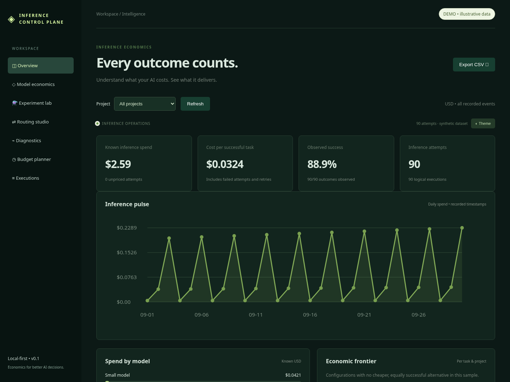
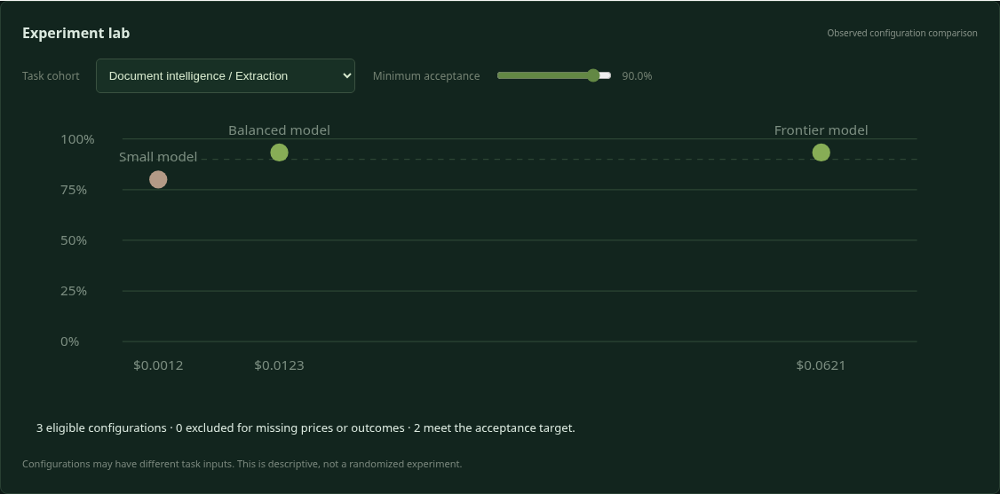
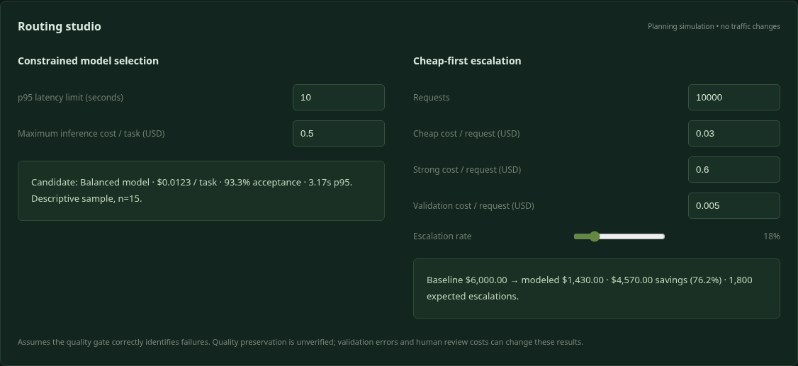
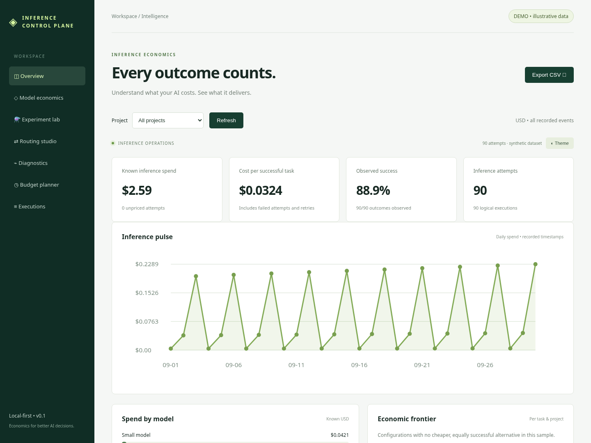
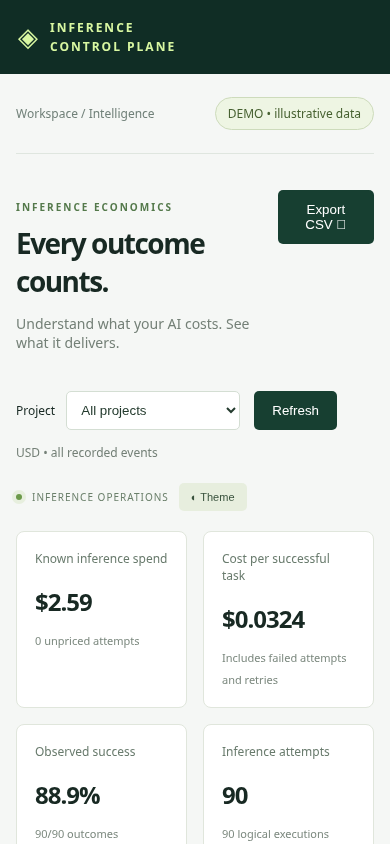

<div align="center">

# AI Inference Control Plane

### Measure the economics. Preserve the outcome.

A local-first toolkit for engineers investigating inference cost, evaluation quality, and model-selection tradeoffs.

[](https://github.com/Ajaffar1/AI-Inference-Control-Plane/actions/workflows/ci.yml)


[Quick start](#quick-start) · [Engineering reference](docs/engineering.md) · [Benchmark protocol](#reproducible-benchmarks) · [Architecture roadmap](docs/blueprint.md)

</div>



*Actual Chromium capture of the read-only synthetic demo. Prices, models and outcomes are illustrative.*

## What it does

Instrument an existing inference call, associate attempts with a logical task, price reported usage against an explicit snapshot, record acceptance, and inspect the cost of successful work. Compare candidate configurations on matched tasks before changing production traffic.

| Capability | Implemented behavior |
|---|---|
| Attempt telemetry | Metadata-only tracking; failures and retry costs stay visible |
| Exact token pricing | BigInt arithmetic, cache-aware rates, serialized nanodollars |
| Pricing lineage | Exact model/region/deployment matches, effective dates, reviewed sources, snapshot hashes |
| Outcome economics | Cost per accepted logical unit; missing outcomes and prices block misleading metrics |
| Benchmark execution | Injected adapters, bounded concurrency, spend reservations, cancellation and failure states |
| Statistical comparison | Matched task IDs, deterministic paired bootstrap, Wilson acceptance intervals |
| OpenAI usage normalization | Responses and Chat Completions token fields; no double billing for included reasoning |
| Diagnostics | Unpriced calls, failed attempts, retry amplification, duplicate IDs and pricing versions |
| Decision dashboard | Spend timeline, cohort frontier, routing constraints, escalation planning, budgets, CSV export |

**Current scope:** a source-distributed, single-process engineering toolkit. No affiliation with or endorsement by OpenAI. No npm publication, hosted service, production multi-tenancy or automated traffic control. The [engineering reference](docs/engineering.md) documents the exact contracts and boundaries.

## Quick start

Requires Node.js 22+. No install step or provider key is needed for the demo.

```sh
git clone --branch codex/r0-library-dashboard https://github.com/Ajaffar1/AI-Inference-Control-Plane.git
cd AI-Inference-Control-Plane
npm run demo
```

Open **http://127.0.0.1:3000**. The branch command previews PR #1 until it is merged. Demo writes are forbidden; the dashboard never calls a paid provider.

```sh
npm test            # economics, statistics, storage, pricing and HTTP checks
npm run example     # synthetic inference + acceptance observation
npm run benchmark   # paired synthetic experiment, no paid calls
```

## Decision workspace

The experiment view compares observed acceptance with inference cost inside a task/project cohort. It exposes the sample size and excludes incomplete evidence from model selection.



*The dashboard plot is descriptive. Use the paired benchmark utilities for matched-task analysis; the plot alone does not establish statistical superiority.*

The routing studio selects an observed candidate under quality, cost and p95 latency constraints. The escalation planner accounts for cheap calls, strong-model escalation and validation cost, including cases where escalation costs more.



*Planning only. It does not modify traffic. Gate accuracy, review time and downstream error costs must be validated separately.*

<details>
<summary>Light mode and mobile screenshots</summary>





</details>

## Instrument an existing provider call

The library uses callbacks so you can retain your SDK, credentials and retry policy. This example assumes you already configured `client`, `store`, `model`, and `input`.

```js
import { createTracker } from './src/index.js';
import { normalizeOpenAIUsage } from './src/diagnostics.js';

const tracker = createTracker({ record: event => store.append(event) });
const { output, event } = await tracker.track({
  project: 'Document intelligence', task: 'Extraction',
  provider: 'OpenAI', model,
  rates: { // Illustrative; replace with a reviewed pricing snapshot.
    version: 'illustrative-v1',
    input: 1000000, cachedInput: 200000, output: 3000000
  }
}, async () => {
  const response = await client.responses.create({ model, input });
  return {
    output: response.output_text,
    usage: normalizeOpenAIUsage(response.usage)
  };
});
await store.recordOutcome(event.executionId, true); // After review, not merely completion.
```

Rates are integer **USD microdollars per million tokens**: `1000000` means $1 per million tokens. Input includes cached tokens. Normalized output includes already-billed reasoning. Missing usage or prices remain unknown. No current provider rates are bundled.

`track` never retries. Reuse `executionId` when retrying the same configuration. A successful inference with failed persistence exposes `error.output` and `error.event`; logging failure should not trigger a duplicate paid call. Failed calls may attach billable usage to `error.usage`.

## Reproducible benchmarks

`npm run benchmark` executes 40 synthetic tasks across control and treatment, saves `data/benchmark.json`, and prints a manifest hash, paired deltas and acceptance intervals. The cheaper synthetic treatment intentionally loses quality.

```js
import { runBenchmark, pairedComparison } from './src/benchmark.js';

const run = await runBenchmark({
  manifest: {
    datasetVersion: 'your-held-out-set-v1',
    promptVersion: 'v14', rubricVersion: 'evidence-v2',
    tasks: [{ id: 'task-001', inputRef: 'private-document-reference' }],
    configurations: [
      { id: 'control', estimatedMaxCost: 0.05 },
      { id: 'treatment', estimatedMaxCost: 0.02 }
    ]
  },
  concurrency: 2, spendLimit: 1,
  execute: yourAdapter,   // Returns { output, cost }; failures may attach error.cost.
  evaluate: yourRubric   // Returns boolean; failure retains cost and unknown acceptance.
});
```

Compare arrays of `{ taskId, cost, accepted }` with `pairedComparison(control, treatment)`. Deltas are **treatment minus control**. Seeded bootstrap resampling preserves matched-task correlation; Wilson intervals describe independent binary acceptance observations. Small or correlated datasets require further analysis. Evaluation costs are tracked separately from inference costs.

Spend reservations rely on caller estimates. Unknown billed cost stops future dispatch; in-flight calls and underestimated prices can exceed a ceiling. The runner does not persist or resume jobs after process failure.

## Reviewed pricing snapshots

`createPricingRegistry` accepts reviewed USD records with exact provider/model/region/deployment identity, effective intervals, source URL and rate version. It rejects overlapping intervals, duplicate versions and unsupported currencies. Each resolution carries a reproducible registry hash.

```js
import { createPricingRegistry } from './src/pricing-registry.js';
const registry = createPricingRegistry(yourReviewedRecords);
const price = registry.price({
  provider: 'OpenAI', model, region: 'global', deployment: 'api',
  timestamp: new Date().toISOString()
}, normalizedUsage);
```

A missing exact match yields unknown cost. Snapshot hashing establishes lineage, not source authenticity. See the [record contract](docs/engineering.md#pricing-provenance). Context tiers, tools, cache storage, discounts, audio/image billing and invoice reconciliation are not implemented.

## Local data and API

```sh
npm run example
node -e "console.log(require('node:crypto').randomBytes(32).toString('hex'))"
export IEOP_TOKEN='your-generated-token'
npm start
```

Enter the token in the dashboard; it stays in tab memory. Stop demo mode first if using the same port. `PORT` defaults to 3000 and `IEOP_DATA` to `./data/events.jsonl`. The server binds to loopback.

| Route | Behavior |
|---|---|
| `GET /api/report?project=...&task=...` | Scoped local report, observed frontier and diagnostics |
| `POST /api/events` | Validated event; identical IDs deduplicate, conflicting records fail |
| `POST /api/outcomes` | `{executionId, accepted}`; appends a boolean outcome observation |

Real-data routes require `Authorization: Bearer <IEOP_TOKEN>`. JSON bodies have a 64 KiB limit. The single-process JSONL journal loads all events into memory and appends outcomes separately. Do not use it as a public or high-volume service. Prompts and outputs are omitted from tracker events; metadata and benchmark manifests can still contain private information.

## Engineering map

```text
Your SDK / application
       │ callback + reported usage
       ▼
Tracker ──► Attempt journal ──► Economics + diagnostics ──► Dashboard
                 ▲                     ▲
                 │                     │
          Outcome journal       Reviewed rate snapshot

Versioned task manifest ──► Bounded benchmark runner
                                  │
                          Adapter → Rubric
                                  │
                    Matched results + manifest hash
                                  │
                    Paired bootstrap / Wilson intervals
```

See [engineering invariants and failure boundaries](docs/engineering.md), [full architecture roadmap](docs/blueprint.md) and [contribution guide](CONTRIBUTING.md). Next major steps are a durable PostgreSQL ledger, production identity, streaming adapters, invoice reconciliation and controlled routing experiments.

## Screenshots and verification

The checked-in screenshots render this repository's synthetic demo in Chromium. Desktop/mobile layout, routing constraints and request inspection were browser-checked.

Optional screenshot tooling is separate from the dependency-free runtime:

```sh
npm install --no-save playwright
npx playwright install chromium
node scripts/screenshots.mjs
```

The script captures five PNGs, checks mobile overflow and fails on browser JavaScript errors. Runtime unit/integration tests run in CI on Node.js 22 and 24.

## License

[MIT](LICENSE). Public source with explicit implementation boundaries. Contributions that improve reproducibility, billing accuracy and evaluation evidence are welcome.
